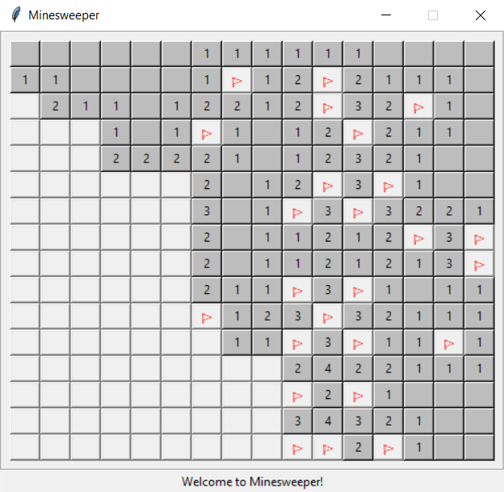

# [Minesweeper](https://en.wikipedia.org/wiki/Minesweeper_(video_game))

To play, run **`python minesweeper.py`**, which will bring up the GUI version of the game. Left-click a cell to uncover it, or right-click a cell to flag it.

The game can also be played through the command line, by running `python minesweeper.py cli`. When in CLI mode, enter `help` to see the commands.

If your terminal has issues displaying coloured text, you can run the program with the `-w` argument, which will avoid changing colours when printing flags.
